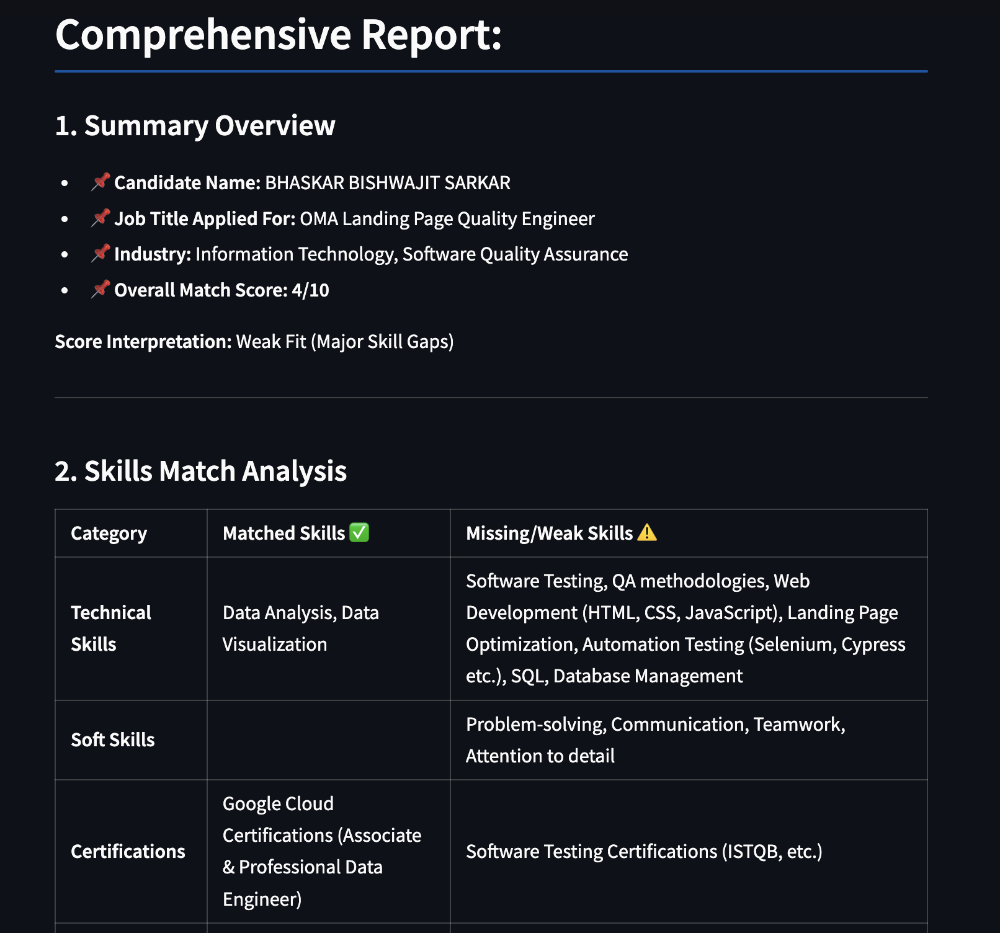

# Job Resume Matcher

The Job Resume Matcher is a web application that helps users match their resumes with job descriptions by extracting, cleaning, and analyzing text from both documents. The application provides a comprehensive report and visual insights to help users understand how well their skills align with the job requirements.

## Features

- **Resume Upload**: Users can upload their resumes in PDF format.
- **Job Description Fetching**: Users can provide a URL to fetch the job description.
- **Text Extraction**: The application extracts text from the uploaded PDF resume and the fetched job description.
- **Text Cleaning**: The extracted text is cleaned to remove unnecessary formatting and preambles.
- **Skill Matching**: The application compares the skills listed in the resume with those required in the job description.
- **Comprehensive Report**: A detailed report is generated, highlighting the matched and missing skills.
- **Visual Insights**: The application provides visual insights through:
  - **Bar Chart**: Shows the percentage of matched vs. missing skills.
  - **Radar Chart**: Compares required vs. available competencies.

## Installation

1. **Clone the Repository**:
   ```sh
   git clone https://github.com/your-username/GenAI_POC.git
   cd GenAI_POC

2.  **Create and Activate a Virtual Environment**:

    ```
    python3 -m venv venv
    
    source venv/bin/activate
    ```

3.  **Install the Requirements**:

    ```pip install -r requirements.txt```

4.  **Set Up Environment Variables**: Create a `.env` file in the root directory and add your API keys:

    ```
    GEMINI_API_KEY=your_gemini_api_key
    ```

Usage
-----

1.  **Run the Application**:

    `streamlit run job_resume_matcher/main.py`

2.  **Upload Your Resume**:

    -   Click on "Choose a file" and upload your resume in PDF format.
3.  **Enter Job Description Link**:

    -   Provide the URL of the job description.
4.  **Submit**:

    -   Click on the "Submit" button to process the resume and job description.
5.  **View Results**:

    -   The application will display a comprehensive report and visual insights, including a bar chart and radar chart.

Demo
----

[](resources/demo/Resume_JD_Matcher_GenAI_POC.mp4)

Dependencies
------------

-   `streamlit`
-   `python-dotenv`
-   `PyMuPDF`
-   `langchain-community`
-   `langchain-google-genai`
-   `nltk`
-   `regex`
-   `matplotlib`
-   `seaborn`
-   `plotly`